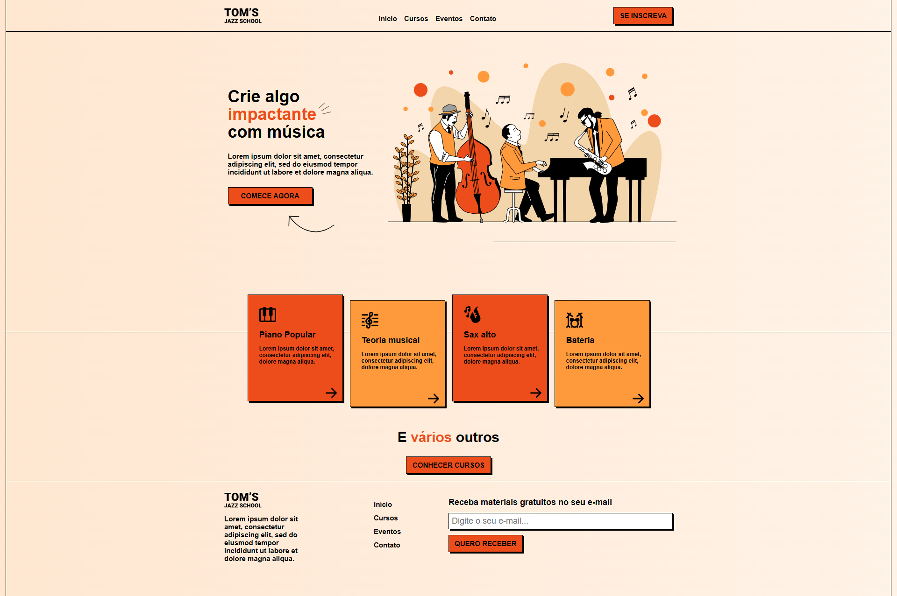

# Tom's Jazz School 🎷

Projeto de estudo desenvolvido com **HTML5** e **CSS3** para prática de layout responsivo, design moderno e uso de variáveis CSS.

## 📚 Descrição

Este projeto simula uma landing page para uma escola fictícia de jazz chamada **Tom's Jazz School**. A interface é responsiva e construída com HTML semântico e CSS puro, utilizando boas práticas de desenvolvimento front-end.

O layout inclui:

- Cabeçalho com navegação.
- Seção principal com destaque visual (hero).
- Seção de cursos com cartões informativos.
- Rodapé com links, informações institucionais e um formulário de newsletter.

## 📸 Preview

## 🚀 Tecnologias Utilizadas

- HTML5
- CSS3
- Google Fonts (Roboto)
- Layout responsivo com media queries
- Flexbox e Grid Layout

## 💡 Aprendizados

Este projeto proporcionou prática em:

- Estruturação HTML semântica.
- Organização e reutilização de estilos com utilitários CSS.
- Técnicas de responsividade com media queries.
- Uso de fontes externas com @import e <link> do Google Fonts.

## 🔗 Links

- URL da solução:  <a href="https://github.com/slayer-br/TomJazzSchool" target="_blank" rel="noopener noreferrer">Tom's Jazz School</a> 
- Site ao vivo: <a href="https://slayer-br.github.io/TomJazzSchool" target="_blank" rel="noopener noreferrer">Tom's Jazz School</a>

## 📌 Status
✅ Projeto concluído para fins educacionais.

## 👨‍💻 Autor
- GitHub - <a href="https://github.com/slayer-br" target="_blank" rel="noopener noreferrer">@slayer-br</a>
- LinkedIn - <a href="https://www.linkedin.com/in/carlos-alberto-da-silva-93758b270/" target="_blank" rel="noopener noreferrer">@slayer-br</a>

## 📄 Licença
Este projeto está sob a licença [MIT](LICENSE).

## 🙏 Agradecimentos

Projeto inspirado e baseado nos conteúdos e desafios do curso da <a href="https://onebitcode.com/" target="_blank" rel="noopener noreferrer">One Bit Code</a>.  
Agradeço à equipe pelo excelente material e pela contribuição à comunidade de desenvolvedores!